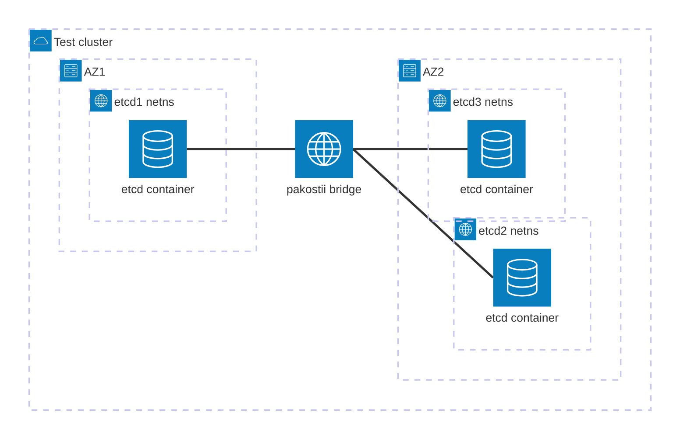

In this guide, we'll build a test that allows as to observe how a serializable read can return a stale data when a node
is separated from the majority of the cluster. You will learn how to set up a pakostii cluster,
apply network isolation faults and interact with cluster members via HTTP.

## Prerequisites

Before you begin, ensure you have the following prerequisites:
- Go version is at least 1.26.2
- You are working on Linux with a kernel version >= 5.9 and BPF/XDP enabled for tests that use network isolation faults.
- Containerd v2 is installed and running on your system.
- You have ability to run programs as root with `sudo`.


import { Aside } from '@astrojs/starlight/components';

<Aside type="note" title="Why do I need sudo?">
    Pakostii interfaces with Linux Kernel, Networking stack and Containerd directly, which requires root access for operations like network provisioning,
    container lifecycle management and fault injection.

    Curerntly each test needs root access, but it is planned to have a dedicated pakostii daemon that will allow to keep test code in non-root user mode.
</Aside>

## Setting up test project
As of now, the only way to use pakostii is via the Go package and running each test as a standalone program.
This is something that will be addressed pretty soon, but anyway, let's proceed.

First and foremost, we need to set up a Go project.

```bash
mkdir pakostii-example
cd pakostii-example
go mod init pakostii-example
```

Then, we'll need to install pakostii itself.

```bash
go get github.com/sotnii/pakostii@latest
```

And for this particular test we will need the etcd client library.

```bash
go get github.com/etcd-io/etcd/client/v3
```

That's it! We're ready to proceed with writing our first line of code.


## Creating a cluster and a basic test

Actually, I lied a bit. Before we proceed with writing code, let's quickly go over how you tell pakostii what cluster to create.

Everything starts with a cluster specification that lets you define nodes. Each node is a abstraction over Linux network namespace, which allows
to simulate running programs on different network nodes. Each node can have one or multiple services (containers) running on it. Nodes may also belong
to a particular availability zone (AZ), which comes in handy when simulating cross-AZ availability issues.

The cluster we're trying to create can be illustrated as follows:




All we need to do to create a cluster like this is to define a cluster spec and add nodes with etcd services to it.
Pakostii will take care of network and container provisioning for us.

```go
package main

import (
	"context"
	"fmt"
	"time"

	"github.com/sotnii/pakostii"
	"github.com/sotnii/pakostii/spec"
	clientv3 "go.etcd.io/etcd/client/v3"
)

func main() {
	cluster := spec.NewCluster()
	// Preparing the names of nodes for the etcd cluster. The name of the node is also used as it's hostname address
	etcdHosts := []string{"etcd1", "etcd2", "etcd3"}

	for i, host := range etcdHosts {
		// Create an etcd service for each host using a dedicated helper for creating an etcd container spec
		etcd := spec.Etcd(
			"etcd", // name of the service, local to the node
			"quay.io/coreos/etcd:v3.6.11", // image of the etcd container
			// configuration helps setup etcd1 in a way to discover other nodes
			spec.EtcdConfig{
				Name:         host,
				RunsOnHost:   etcdHosts[i],
				ClusterHosts: etcdHosts,
			},
		)

		// We're creating a 3-node cluster with etcd1 running in AZ1 and etcd2/etcd3 running in AZ2
		az := 1
		if i > 0 {
			az = 2
		}

		// This creates node spec that defines a node with a specific AZ and runs the etcd service on it
		node := spec.
					NewNode(host).
					WithAZ(fmt.Sprintf("az%d", az)).
					Runs(etcd)

		cluster.AddNode(node)
	}
}
```

With this block of code we've programatically defined a cluster with 3 nodes running etcd. We've assigned each etcd instance to a specific AZ, which will
allow us to apply network isolation to observe a stale read from etcd.

Let's proceed to creating the test environment.

```go
// ... Cluster spec creation ...

// Besides the cluster spec, each tests needs a name that is used to identify test runs later.
test := pakostii.NewTest("etcd_stale_read", cluster)
```

Now we're ready to run the test. Let's start simple.

```go
// ... Previous code ...

test.Run(context.Background(), func(t *pakostii.TestHandle) error {
	t.Logger.Info("Hello, World!")
	return nil
})
```

By calling `test.Run`, we instruct pakostii to provision the cluster and give control over the cluster to us.
Before we explore what we can do using the `TestHandle`, let's just log a message to make sure everything is working.

```bash
# Build the example program
go build -o pakostii-example main.go

# Remember to run as root, otherwise pakostii
# will not be able to provision the cluster
sudo ./pakostii-example
```

After that, you will see logs appearing in your terminal. You might have to wait a bit after the "preparing containers" logs for pakostii to download
and run your containers. Sequential runs will be faster once images are downloaded to your computer.

```log
time=2026-05-10T11:24:55.257+03:00 level=INFO msg="runtime for test \"etcd_stale_read\" starting" test_id=zftsk nodes=3 artifacts_dir=.pakostii/etcd_stale_read-zftsk work_dir=/tmp/pakostii
time=2026-05-10T11:24:55.258+03:00 level=INFO msg="preparing runtime" test_id=zftsk
time=2026-05-10T11:24:55.258+03:00 level=INFO msg="preparing network" test_id=zftsk component=network_manager
time=2026-05-10T11:24:55.326+03:00 level=INFO msg="network ready for node etcd1" test_id=zftsk component=network_manager namespace=pkst-node-vpxon ip=10.0.0.3
time=2026-05-10T11:24:55.353+03:00 level=INFO msg="network ready for node etcd2" test_id=zftsk component=network_manager namespace=pkst-node-jfbyp ip=10.0.0.4
time=2026-05-10T11:24:55.385+03:00 level=INFO msg="network ready for node etcd3" test_id=zftsk component=network_manager namespace=pkst-node-ssowi ip=10.0.0.5
time=2026-05-10T11:24:55.385+03:00 level=INFO msg="preparing containers" test_id=zftsk component=container_manager
time=2026-05-10T11:25:11.429+03:00 level=INFO msg="container running" test_id=zftsk component=container_manager node=etcd2 container_id=pkst-zftsk-etcd2-etcd-jjeve name=etcd
time=2026-05-10T11:25:11.490+03:00 level=INFO msg="container running" test_id=zftsk component=container_manager node=etcd1 container_id=pkst-zftsk-etcd1-etcd-jzwde name=etcd
time=2026-05-10T11:25:12.490+03:00 level=INFO msg="container running" test_id=zftsk component=container_manager node=etcd3 container_id=pkst-zftsk-etcd3-etcd-vlagp name=etcd
time=2026-05-10T11:25:12.490+03:00 level=INFO msg="runtime ready" test_id=zftsk
time=2026-05-10T11:25:12.490+03:00 level=INFO msg="starting test \"etcd_stale_read\"" test_id=zftsk
time=2026-05-10T11:25:12.490+03:00 level=INFO msg="Hello, World!" test_id=zftsk
time=2026-05-10T11:25:12.495+03:00 level=INFO msg="artifacts collected" test_id=zftsk destination=.pakostii/etcd_stale_read-zftsk
time=2026-05-10T11:25:12.495+03:00 level=INFO msg="tearing down runtime" test_id=zftsk
time=2026-05-10T11:25:12.625+03:00 level=INFO msg="containers tore down" test_id=zftsk
time=2026-05-10T11:25:12.630+03:00 level=INFO msg="network tore down" test_id=zftsk
time=2026-05-10T11:25:12.630+03:00 level=INFO msg="test passed"
```

By looking at the logs, we can see how pakostii provisions the network and runs containers. Once the environment is ready, the test is
started and we can see our "Hello, World!" message logged as well. After that, our tests returns `nil`, which means the test passed.
Pakostii collects logs from the containers and tears down everything it created.

The location for all test artifacts is `.pakostii` directory in the current working directory. Let's look at the general structure of the directory:

import { FileTree } from '@astrojs/starlight/components';

<FileTree>
- .pakostii
    - \<test-name\>-\<test-id\>
        - logs
            - \<node1-name\>
                - \<service1-name\>
                    - stderr
                    - stdout
                - \<service2-name\>
                    - stderr
                    - stdout
            - \<node1-name\>
                - \<service1-name\>
                    - stderr
                    - stdout
</FileTree>

Each test has a unique test ID that is generated on every test run, you might have noticed the `test_id` field in the logs. Pakostii will use test name and
test ID to organize the logs for each test run.
During runtime, pakostii collects stdin and stdout for each containers and stores the logs for each service under a node directory the service belongs to.

With that out of the way, we are ready to explore what we can do during the test run.


## Port forwarding and etcd client setup

We want interact with the etcd instances using the go etcd client library, but since all nodes in a cluster run in an
isolated LAN that is not accessible from the host network by default, we will need to setup port forwarding for our etcd instances.

To do that, we will use pakostii's `t.Network().ForwardPort()` API. For this test, we will only need to access `etcd1` and `etcd2`.
Replace your "Hello World!" log with the following code:

```go
test.Run(context.Background(), func(t *pakostii.TestHandle) error {
    clients := make([]*clientv3.Client, 2)
	for _, host := range []string{"etcd1", "etcd2"} {
		fw, err := t.Network().ForwardPort(host, 2379)
		if err != nil {
			return err
		}
		err = fw.Listen(t.Ctx)
		if err != nil {
			return err
		}
		// Although pakostii will automatically cleanup any ports it uses, you have control over when to close the port forwarding
		defer fw.Close()

		// Create an endpoint URL for the etcd client to use
		etcdEndpoint := fmt.Sprintf("http://localhost:%d", fw.Port())
		client, err := clientv3.New(clientv3.Config{
			Endpoints:   []string{etcdEndpoint},
			DialTimeout: 5 * time.Second,
			// We will need that to avoid retrying indefinitely in case of network issues
            MaxUnaryRetries: 3,
		})
		if err != nil {
			return err
		}
		defer client.Close()
		clients = append(clients, client)
	}
	return nil
})
```

This piece of code will ask pakostii to setup port forwarding by assigning a random local port that will forward traffic to `etcd1:2379` and `etcd2:2379`.
Using the port forwarding, we setup 2 etcd clients, one for each node.

Without further ado, let's insert and get a value from etcd:

```go
clientA := clients[0]
_, err = clientA.Put(t.Ctx, "foo", "bar")
if err != nil {
	return err
}

resp, err := clientA.Get(t.Ctx, "foo")
if err != nil {
	return err
}

t.Logger.Info("got foo", "value", resp.Kvs[0].Value)
```

Let's run the test again and look at the logs. Amongst other logs we've already seen, you should see a log line similar to the following:
```
time=2026-05-10T11:57:36.626+03:00 level=INFO msg="got foo" test_id=dlarb value="bar"
```

We've successfully put a value in the etcd cluster and retrieved it back.

:::note
Notice the usage of `t.Ctx`. The handle provides a context for us to use in long running operations so that anything can be cancelled if test execution cancels.
:::

## Applying isolations

Now our cluster has a value in it. Let's try isolating `etcd1` from the cluster, update the value in `etcd2` and see what happens when we read from `etcd1`.
We'll start with isolating `etcd1`. For that, we need to use `t.Network().Partition().IsolateAZ()`:

```go
// Create the isolation on az1, which contains etcd1
isolation := t.Network().Partition().IsolateAZ("leader isolation", "az1").WithNetworkAccess()
err = isolation.Apply()
if err != nil {
	return err
}
// Same as with port forwarding, pakostii makes sure isolations are automatically healed after the test finishes,
// But we always have the option to control when to stop the isolation for more complex scenarios.
defer isolation.Heal()
```

`IsolateAZ` accepts an arbitrary name for our isolation, as well as the name of the AZ to isolate. Since we have put `etcd1` in `az1`, and `etcd2` and `etcd3` in `az2`,
we can easily isolate `etcd1` from the cluster by applying isolation to `az1`.
By default, pakostii completely isolates a node, meaning even port forwards will not work for isolated nodes, to fix that, we explicitly allow outside network access for our etcd clients
via `WithNetworkAccess()`.

Let's put isolation code after our first etcd writes and reads, and update `foo` using the second client that talks to `etcd2`:

```go
// Create the isolation on az1, which contains etcd1
isolation := t.Network().Partition().IsolateAZ("leader isolation", "az1").WithNetworkAccess()
err = isolation.Apply()
if err != nil {
	return err
}
// Same as with port forwarding, pakostii makes sure isolations are automatically healed after the test finishes,
// But we always have the option to control when to stop the isolation for more complex scenarios.
defer isolation.Heal()

t.Logger.Info("waiting for new leader to be elected")
// We'll wait 5 seconds to account for leader re-election in the majoriy
time.Sleep(time.Second * 5)

clientB := clients[1]
_, err = clientB.Put(t.Ctx, "foo", "baz")
if err != nil {
	return err
}
t.Logger.Info("updated foo=baz in az2")

resp, err := clientA.Get(t.Ctx, "foo")
if err != nil {
	return err
}
val := string(getResp.Kvs[0].Value)
if val != "baz" {
	return fmt.Errorf("expected value 'baz', got '%s'", val)
}

return nil
```

## Observing linearizable reads in etcd

If we run our test now, we will be able to observe how etcd handles when a node cannot sync with the rest of the cluster.
After `updated foo=baz in az2` log, etcd client will start logging errors about request timeouts, and the test will eventually fail after a few retries.

```log
...
time=2026-05-10T12:34:35.261+03:00 level=INFO msg="updated foo=baz in az2" test_id=kbkrq
{"level":"warn","ts":"2026-05-10T12:34:42.262371+0300","logger":"etcd-client","caller":"v3@v3.6.11/retry_interceptor.go:68","msg":"retrying of unary invoker failed","target":"etcd-endpoints://0x2425304503c0/localhost:35485","peer":"Peer{Addr: '[::1]:35485', LocalAddr: '[::1]:58560', AuthInfo: 'insecure'}","method":"/etcdserverpb.KV/Range","attempt":0,"error":"rpc error: code = Unavailable desc = etcdserver: request timed out"}
{"level":"warn","ts":"2026-05-10T12:34:49.289306+0300","logger":"etcd-client","caller":"v3@v3.6.11/retry_interceptor.go:68","msg":"retrying of unary invoker failed","target":"etcd-endpoints://0x2425304503c0/localhost:35485","peer":"Peer{Addr: '[::1]:35485', LocalAddr: '[::1]:58560', AuthInfo: 'insecure'}","method":"/etcdserverpb.KV/Range","attempt":1,"error":"rpc error: code = Unavailable desc = etcdserver: request timed out"}
{"level":"warn","ts":"2026-05-10T12:34:56.315866+0300","logger":"etcd-client","caller":"v3@v3.6.11/retry_interceptor.go:68","msg":"retrying of unary invoker failed","target":"etcd-endpoints://0x2425304503c0/localhost:35485","peer":"Peer{Addr: '[::1]:35485', LocalAddr: '[::1]:58560', AuthInfo: 'insecure'}","method":"/etcdserverpb.KV/Range","attempt":2,"error":"rpc error: code = Unavailable desc = etcdserver: request timed out"}
time=2026-05-10T12:34:56.334+03:00 level=INFO msg="artifacts collected" test_id=kbkrq destination=.pakostii/etcd_stale_read-kbkrq
time=2026-05-10T12:34:56.334+03:00 level=INFO msg="tearing down runtime" test_id=kbkrq
time=2026-05-10T12:34:56.421+03:00 level=INFO msg="containers tore down" test_id=kbkrq
time=2026-05-10T12:34:56.426+03:00 level=INFO msg="network tore down" test_id=kbkrq
time=2026-05-10T12:34:56.426+03:00 level=ERROR msg="test failed" error="etcdserver: request timed out"
```

This happens because etcd client reads are linearizable, which means the node must sync it's state with the cluster before responding to the client.

From etcd [documentation](https://etcd.io/docs/v3.5/learning/api_guarantees):
> etcd ensures linearizability for all other operations by default.
> Linearizability comes with a cost, however, because linearized requests must go through the Raft consensus process.
> To obtain lower latencies and higher throughput for read requests, clients can configure a request’s consistency mode to serializable, which may access stale data with respect to quorum,
> but removes the performance penalty of linearized accesses’ reliance on live consensus.

Since we have isolated `etcd1`, cluster sync will never happen. If you go to the `etcd1` logs, you will find logs about it:

```log
{"level":"warn","ts":"2026-05-10T09:34:54.794821Z","caller":"rafthttp/probing_status.go:68","msg":"prober detected unhealthy status","round-tripper-name":"ROUND_TRIPPER_RAFT_MESSAGE","remote-peer-id":"bd388e7810915853","rtt":"0s","error":"dial tcp 10.0.0.5:2380: i/o timeout"}
{"level":"warn","ts":"2026-05-10T09:34:54.819120Z","caller":"etcdserver/v3_server.go:1016","msg":"waiting for ReadIndex response took too long, retrying","sent-request-id":10590106845659764778,"retry-timeout":"500ms"}
```

## Observing stale reads using serializable reads
To avoid this built-in stale-read protection in etcd, we can use serializable reads. To do that, let's update our last get request from client A:

```go
resp, err = clientA.Get(t.Ctx, "foo", clientv3.WithSerializable())
```

If we run our test again, etcd will allow stale reads, thus, making the test fail:

```log
time=2026-05-10T12:41:17.581+03:00 level=ERROR msg="test failed" error="expected value 'baz', got 'bar'"
```

## Congratulations!

That's it! We successfully setup an etcd cluster, isolated one node and got a stale read from it. Of course, we haven't found any bugs today,
but we've learned about how etcd handles network issues and cluster split-brain scenarios. The example code have been simplified for clarity purposes,
but you can find a more complete example in the [etcd stale read example](https://github.com/sotnii/pakostii/blob/main/examples/etcd_stale_read/main.go) in the pakostii's examples.

You can also head over to [examples](/pakostii/examples) to see a full list of examples available in the pakostii repository,
which will provide more details on APIs provided by pakostii.

## Full code

```go
package main

import (
  "context"
  "fmt"
  "time"

  "github.com/sotnii/pakostii"
  "github.com/sotnii/pakostii/spec"
  clientv3 "go.etcd.io/etcd/client/v3"
)

func main() {
  cluster := spec.NewCluster()
  // Preparing the names of nodes for the etcd cluster. The name of the node is also used as it's hostname address
  etcdHosts := []string{"etcd1", "etcd2", "etcd3"}

  for i, host := range etcdHosts {
    // Create an etcd service for each host using a dedicated helper for creating an etcd container spec
    etcd := spec.Etcd(
      "etcd", // name of the service, local to the node
      "quay.io/coreos/etcd:v3.6.11", // image of the etcd container
      // configuration helps setup etcd1 in a way to discover other nodes
      spec.EtcdConfig{
        Name:         host,
        RunsOnHost:   etcdHosts[i],
        ClusterHosts: etcdHosts,
      },
    )

    // We're creating a 3-node cluster with etcd1 running in AZ1 and etcd2/etcd3 running in AZ2
    az := 1
    if i > 0 {
      az = 2
    }

    // This creates node spec that defines a node with a specific AZ and runs the etcd service on it
    node := spec.
          NewNode(host).
          WithAZ(fmt.Sprintf("az%d", az)).
          Runs(etcd)

    cluster.AddNode(node)
  }

  // Besides the cluster spec, each tests needs a name that is used to identify test runs later.
  test := pakostii.NewTest("etcd_stale_read", cluster)

  test.Run(context.Background(), func(t *pakostii.TestHandle) error {
      clients := make([]*clientv3.Client, 2)
    for _, host := range []string{"etcd1", "etcd2"} {
      fw, err := t.Network().ForwardPort(host, 2379)
      if err != nil {
        return err
      }
      err = fw.Listen(t.Ctx)
      if err != nil {
        return err
      }
      // Although pakostii will automatically cleanup any ports it uses, you have control over when to close the port forwarding
      defer fw.Close()

      // Create an endpoint URL for the etcd client to use
      etcdEndpoint := fmt.Sprintf("http://localhost:%d", fw.Port())
      client, err := clientv3.New(clientv3.Config{
        Endpoints:   []string{etcdEndpoint},
        DialTimeout: 5 * time.Second,
        // We will need that to avoid retrying indefinitely in case of network issues
              MaxUnaryRetries: 3,
      })
      if err != nil {
        return err
      }
      defer client.Close()
      clients = append(clients, client)
    }

    clientA := clients[0]
    _, err = clientA.Put(t.Ctx, "foo", "bar")
    if err != nil {
      return err
    }

    resp, err := clientA.Get(t.Ctx, "foo")
    if err != nil {
      return err
    }

    t.Logger.Info("got foo", "value", resp.Kvs[0].Value)


    // Create the isolation on az1, which contains etcd1
    isolation := t.Network().Partition().IsolateAZ("leader isolation", "az1").WithNetworkAccess()
    err = isolation.Apply()
    if err != nil {
      return err
    }
    // Same as with port forwarding, pakostii makes sure isolations are automatically healed after the test finishes,
    // But we always have the option to control when to stop the isolation for more complex scenarios.
    defer isolation.Heal()

    t.Logger.Info("waiting for new leader to be elected")
    // We'll wait 5 seconds to account for leader re-election in the majoriy
    time.Sleep(time.Second * 5)

    clientB := clients[1]
    _, err = clientB.Put(t.Ctx, "foo", "baz")
    if err != nil {
      return err
    }
    t.Logger.Info("updated foo=baz in az2")

    resp, err = clientA.Get(t.Ctx, "foo", clientv3.WithSerializable())
    if err != nil {
      return err
    }
    val := string(getResp.Kvs[0].Value)
    if val != "baz" {
      return fmt.Errorf("expected value 'baz', got '%s'", val)
    }

    return nil
  })
}
```
